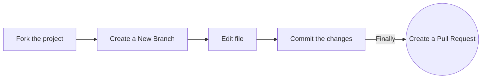

# Terminal-Based E-Commerce System

A Python-based terminal e-commerce system where users can register, log in, browse products, add items to their cart, place orders, and view their order history. The system stores data for users and products using JSON files and supports user authentication with password encryption, using a secure key stored separately.

## Features

- User Registration & Login: New users can register with a unique username and password. Existing users can log in using their credentials.
- View Products: Users can view available products with pricing and stock information.
- Add Products to Cart**: Users can add products to their shopping cart, with stock validation.
- Place Orders: Users can place orders for items in their cart, and stock is updated accordingly.
- Order History: Users can view their past orders.
- Product Management**: Products are managed via a JSON file, which supports stock updates and changes.
- Secure Storage**: User passwords are encrypted and decrypted using a key stored in a separate secure storage folder.

## Project Structure

```bash
.
├── main.py                # Main script to run the system
├── users.json             # JSON file to store user data (passwords are encrypted)
├── secure_storage/        # Folder containing the encryption key
│   └── key.key            # Key file for encrypting and decrypting user passwords
├── utils/
│   ├── products.json      # JSON file containing product data
│   └── helper.py          # Helper functions for password encryption and decryption
└── README.md              # Project documentation

```

# Running the Terminal-Based E-Commerce System

## Prerequisites

- Ensure you have Python installed on your machine (Python 3.6 or higher recommended).
- Make sure you have `pip` for installing any required packages.

## Steps to Run the Application

1. **Clone the Repository:**
   - Use the following command to clone the project repository to your local machine:
     ```bash
     git clone <repository-url>
     ```

2. **Navigate to the Project Directory:**
   - Change into the project directory:
     ```bash
     cd Terminal-Based-E-Commerce-System
     ```

3. **Install Required Packages:**
   - If there are any dependencies listed in a `requirements.txt` file (if applicable), install them using:
     ```bash
     pip install cryptography
     ```

4. **Run the Application:**
   - Start the application by executing the main script:
     ```bash
     python main.py
     ```

5. **Follow On-Screen Prompts:**
   - Follow the instructions displayed in the terminal to register, log in, and use the system.


## How to Contribute to Terminal-Based E-Commerce System

### Option 1. Complete this process in GitHub (in your browser)



**1. Fork the project:**

- Click the gray <kbd>Fork</kbd> button at the top right of the previous page. This creates your copy of the project and saves it as a new repository in your GitHub account.

**2. Create a New Branch:**

- On your new repository's page, click the gray main button in the upper left to reveal a dropdown menu.
- Enter the name of your new branch in the text box. (Branch names usually refer to what is being changed. Example: nameAdd).
- Click on Create branch `<new branch name>`, which will automatically take you to your new branch. You can make edits on the main branch, but this may cause issues down the line. The best practice is to create a new branch for each separate issue you work on. That way your main branch remains in sync with the project’s main branch.

**3. Edit:**

- Make the required changes to the code as per the issue description.

**4. Raise a Pull Request:**

- Click the `Pull Requests` option in your forked repository (which is the third option at the top of this page after the options `Code` and `Issues`).
- Click the green New Pull Request button. This will prep the new pull request for you by auto-filling the base repository: base with 'GssocCommunity: main' AND auto-filling your head repository: compare with your repository: main.
- Click on your head repository's `compare` dropdown, and switch branches from your 'main' branch to `<new branch name>`.
- Finally, click the green `Create Pull Request` button. Great job! You did it!

### Option 2. Complete this process on your computer (locally)

**1. Fork the project:**

- Click the gray <kbd>Fork</kbd> button at the top right of the previous page. This creates your copy of the project and saves it as a new repository in your GitHub account.

**2. Clone this project on your computer:**

- Go to your profile. You will find a forked repo named **Terminal-Based-E-Commerce-System**. Go to the repo by clicking on it.
- Click on the green Code button, then either the HTTPS or SSH option, and click the icon to copy the URL. Now you have a copy of the project. Thus, you can play around with it locally on your computer.

```bash
git clone https://github.com/<your-github-username>/Terminal-Based-E-Commerce-System.git
```

- Switch to the cloned folder. You can paste this command into the same terminal window.

```bash
cd Terminal-Based-E-Commerce-System
```

**3. Open in code Editor:**

- Use your code editor (like VS Code) to open the README.md file.

**4. Create a new branch:**

- A branch name can represent the changes you're making (e.g., add-product-feature). A good practice is to use your GitHub username for the branch name to make it unique.

- To create a new branch, run the following command in your terminal:

```bash
git checkout -b <name-of-new-branch>
```

**5. Edit the File:**

- Make the required changes to the code as per the issue description.

**6. Stage your changes:**

```bash
git add README.md
```

or

```bash
git add .
```

**7. Commit the changes:**

```bash
git commit -m "Add <your-github-username>"
```

- Check the status of your repository.

```bash
git status
```

- The response should be like this:

```bash
On branch <name-of-your-branch>
nothing to commit, working tree clean
```

**8. Push your repository to GitHub:**

```bash
git push origin <name-of-your-branch>
```

or

```bash
git branch -M main
git push -u origin main
```

> **Warning**: If you get an error message like the one below, you probably forgot to fork the repository before cloning it. It is best to start over and fork the project repository first.

```bash
ERROR: Permission to https://github.com/Hacktoberfest-Event-Timer/eventTimer.git denied to <your-github-username>.
fatal: Could not read from remote repository.
Please make sure you have the correct access rights and that the repository exists.
```

**9. Raise a Pull Request:**

- On the GitHub website, navigate to your forked repo - on the top of the files section, you'll notice a new section containing a `Compare & Pull Request` button!

- Click on that button, this will load a new page, comparing the local branch in your forked repository against the main branch of the Terminal-Based E-Commerce System repository. Do not make any changes in the selected values of the branches (do so only if needed), and click the green `Create Pull Request` button. 
  Note: A pull request allows us to merge your changes with the original project repo.

- Your pull request will be reviewed and then eventually merged.

Hurray! You successfully made your first contribution! 🎉

---

## How can I fix a merge conflict?

A GitHub conflict is when people make changes to the same area or line in a file. This must be fixed before it is merged to prevent collision in the main branch.

- **To read more about this, go to [GitHub Docs - About Merge Conflicts](https://docs.github.com/en/github/collaborating-with-pull-requests/addressing-merge-conflicts/about-merge-conflicts)**

- **To find out about how to fix a Git Conflict, go to [GitHub Docs - Resolve Merge Conflict](https://docs.github.com/en/github/collaborating-with-pull-requests/addressing-merge-conflicts/resolving-a-merge-conflict-on-github)**
